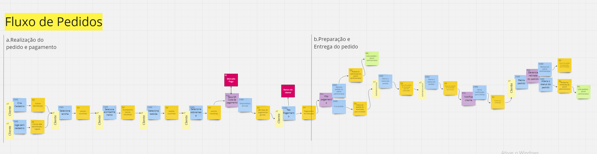
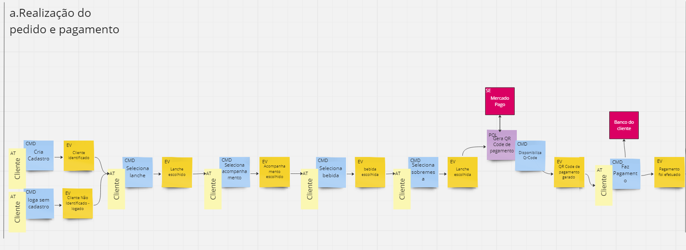
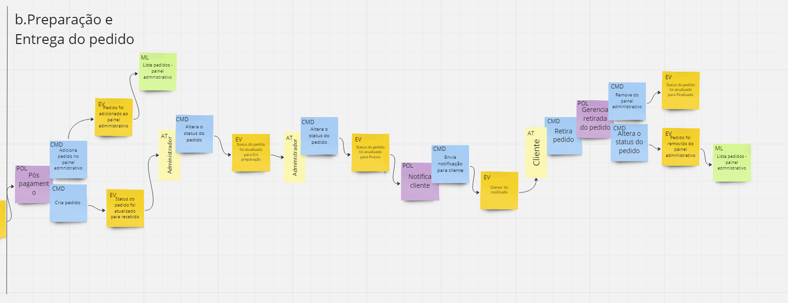
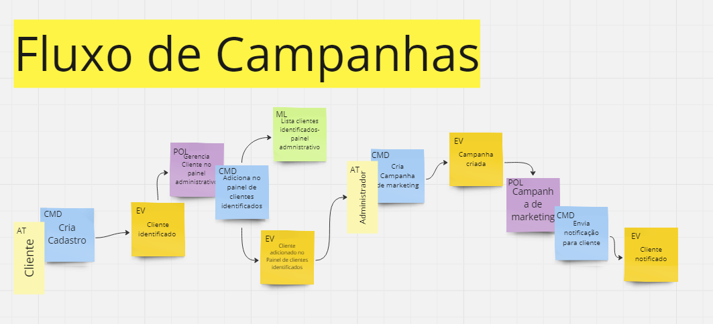
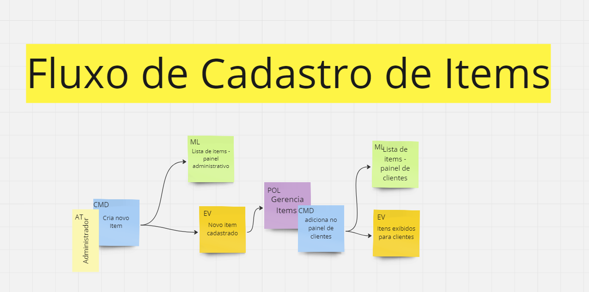

# FastFood
Repositório de entrega de Trabalho da Fiap Curso de Arquitetura de Software

# Dicionário linguagem Ubíqua

| termo               | significado          |
|---------------------|----------------------|
| pedido              | conjunto de até 4 items que formam a compra de um cliente, esse pedido pode ser formado por até um lanche, um acompanhamento, uma bebida e uma sobremesa |
| item                 | um item é uma das entidades comercializadas pela lanchonete, o item pode ser de 4 categorias: lanche, acompanhamento, bebida e sobremesa|
| categoria | São 4 tipos que classificam os items, as categorias podem ser: lanche, acompanhamento, bebida ou sobremesa |
| cliente | usuário que se utiliza do sistema para gerar um pedido |
| cliente identificado | cliente que se cadastrou no sistema com nome e e-mail ou cpf |
| administrador | usuário que tem acesso ao painel admnistrativo para fazer cadastro de items, gerar campanhas para os clientes ou atualizar o andamento de pedidos |
| painel administrativo | É uma interface gráfica onde os administradores podem fazer 3 atividades, atualizar o andamento dos pedidos, cadastrar items ou gerar campanhas de marketing para clientes |
| status do pedido | o status do pedido determina em que etapa do processo até a entrega o pedido está, podendo ser dividido em: recebido , em preparação, pronto e finalizado |
| cliente anônimo | cliente que não se cadastrou nem por CPF nem por nome e email
| status recebido | pedido adicionado no sistema |
| status em preparação | pedido está sendo preparado pela cozinha |
| status pronto | pedido está apto a ser retirado pelo cliente |
| status finalizado | pedido foi retirado pelo cliente |

# EventStorming

Foram desenhados 3 fluxos principais utilizando a técnica de EventStorming, esses 3 fluxos foram: Fluxo de pedidos, Fluxo de campanhas e Fluxo de Cadastro de itens

## Fluxo de pedidos

que por sua vez, pode ser dividido em dois fluxos:

### a.Realização do pedido e pagamento

### b.Preparação e Entrega do pedido

# Fluxos Extras

## Fluxo de Campanhas

## Fluxo de Cadastro de items

Para visualização mais fácil e completa: [EventStorming](https://miro.com/welcomeonboard/UElJdjNsbXhCU2JKTjFKeFFYaXFPQ1cwT2w1d3hnUGRFd0hHUEx2ZGRhOHplMFhlaWZIZVY5Z1EzRE1wY3NXZnwzNDU4NzY0NTk1Mzg2MjM0MzIwfDI=?share_link_id=552096779953)
