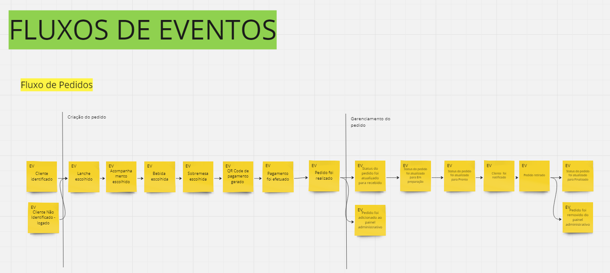
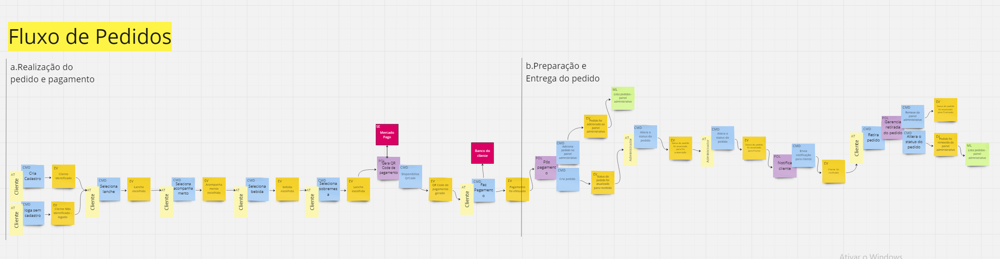
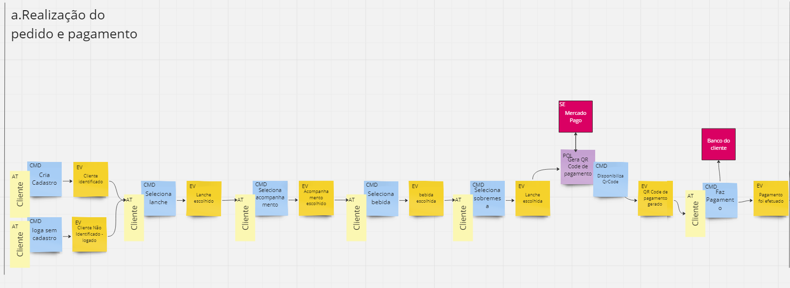
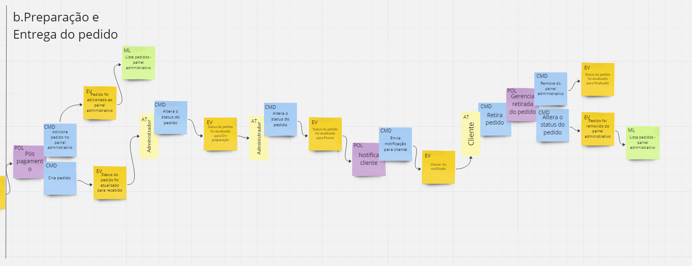
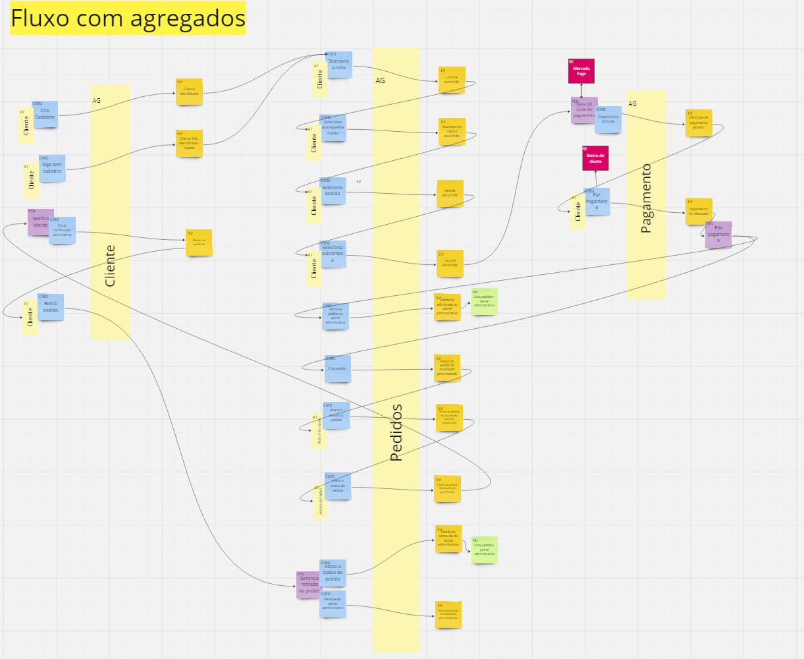
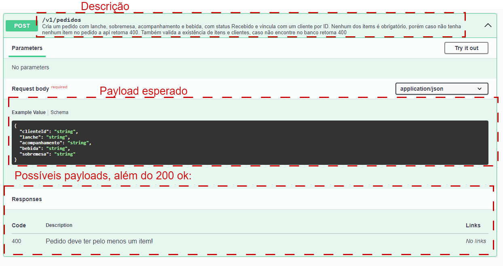
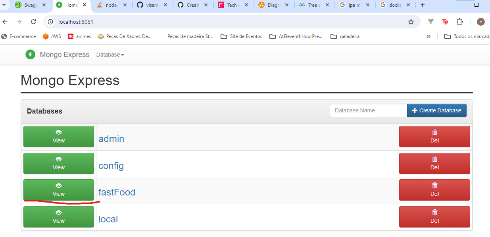

# Informações da entrega
- Grupo: Grupo 49
- Integrantes: Vinícius Teixeira Sant' Anna (Infelizmente não consegui entrar em contato com nenhum outro membro, nem por discord , nem e-mail nem mesmo linkedIn)
- email: vinitsantanna@gmail.com
- Discord: visantanna#0176 -> visantanna - #rm357722
- RM: rm357722

acesso a toda documentação e aplicação a partir do link: https://github.com/visantanna/FastFood/tree/main
<b>Toda a documentação e parte da entrega está no README.md do Repositório!!</b>

# FastFood
Repositório de entrega de Trabalho da Fiap Curso de Arquitetura de Software

# Dicionário linguagem Ubíqua

| termo               | significado          |
|---------------------|----------------------|
| pedido              | conjunto de até 4 items que formam a compra de um cliente, esse pedido pode ser formado por até um lanche, um acompanhamento, uma bebida e uma sobremesa |
| item                 | um item é uma das entidades comercializadas pela lanchonete, o item pode ser de 4 categorias: lanche, acompanhamento, bebida e sobremesa|
| categoria | São 4 tipos que classificam os items, as categorias podem ser: lanche, acompanhamento, bebida ou sobremesa |
| cliente | usuário que se utiliza do sistema para gerar um pedido |
| cliente identificado | cliente que se cadastrou no sistema com nome e e-mail ou cpf |
| administrador | usuário que tem acesso ao painel admnistrativo para fazer cadastro de items, gerar campanhas para os clientes ou atualizar o andamento de pedidos |
| painel administrativo | É uma interface gráfica onde os administradores podem fazer 3 atividades, atualizar o andamento dos pedidos, cadastrar items ou gerar campanhas de marketing para clientes |
| status do pedido | o status do pedido determina em que etapa do processo até a entrega o pedido está, podendo ser dividido em: recebido , em preparação, pronto e finalizado |
| cliente anônimo | cliente que não se cadastrou nem por CPF nem por nome e email
| status recebido | pedido adicionado no sistema |
| status em preparação | pedido está sendo preparado pela cozinha |
| status pronto | pedido está apto a ser retirado pelo cliente |
| status finalizado | pedido foi retirado pelo cliente |

# EventStorming

Para visualização mais fácil e completa dos fluxos do EventStorming acessar: [EventStorming](https://miro.com/welcomeonboard/UElJdjNsbXhCU2JKTjFKeFFYaXFPQ1cwT2w1d3hnUGRFd0hHUEx2ZGRhOHplMFhlaWZIZVY5Z1EzRE1wY3NXZnwzNDU4NzY0NTk1Mzg2MjM0MzIwfDI=?share_link_id=552096779953)

## Desenho inicial apenas com os eventos (Fluxo de eventos):


Foram desenhados 3 fluxos principais utilizando a técnica de EventStorming, esses 3 fluxos foram: Fluxo de pedidos, Fluxo de campanhas e Fluxo de Cadastro de itens

## Fluxo de pedidos



que por sua vez, pode ser dividido em dois fluxos:

### a.Realização do pedido e pagamento



### b.Preparação e Entrega do pedido




### Fluxo completo de pedidos com agregados



# Aplicação 

## Descrição da implementação

Esse Código foi desenvolvido com a linguagem de programação kotlin e framework: springboot e Spring Data Mongo DB
além disso o banco de dados utilizado foi o mongodb, também me utilizei do mongo-express para ter um acesso fácil ao banco de dados. 
A arquitetura de software utilizada foi Hexagonal (ou Ports and Adapters)

Estrutura de pastas:

```
├───src
   ├───main
   │   ├───kotlin
   │   │   └───com
   │   │       └───fiap
   │   │           └───fastfood
   │   │               └───fastfood
   │   │                   ├───adapter  (# pasta dos adaptadores)
   │   │                   │   ├───input 
   │   │                   │   │   └───rest (# administação de operações HTTP)
   │   │                   │   │       ├───config
   │   │                   │   │       ├───helper
   │   │                   │   │       ├───request
   │   │                   │   │       └───response
   │   │                   │   └───output  (# Envio de dados para o banco de dados/ banco de imagens)
   │   │                   │       ├───file (# Adapters para salvar imagens)
   │   │                   │       └───repository (# Adapter para salvar dados no banco mongo)
   │   │                   │           ├───entities 
   │   │                   │           └───repo
   │   │                   └───application  (# Camada da aplicação onde ficam as portas, domínio e usecases)
   │   │                       ├───domain
   │   │                       │   ├───exception
   │   │                       │   ├───model           (# Entidades principais)
   │   │                       │   ├───usecases        (# Usecases, lógica central do domínio)
   │   │                       │   │   ├───cliente
   │   │                       │   │   ├───item
   │   │                       │   │   └───pedido
   │   │                       │   └───validation      (# Validações em cima dos requests)
   │   │                       └───ports
   │   │                           ├───input
   │   │                           │   └───rest        (# Portas de administração de operações HTTP)
   │   │                           ├───output
   │   │                           │   ├───file        (# Portas de gerenciamento de arquivo/imagens)
   │   │                           │   └───repository  (# Portas de gerenciamento de banco de dados)
   │   │                           └───service
   │   │                               ├───cliente
   │   │                               ├───item
   │   │                               └───pedido
   │   └───resources
   │       ├───static
   │       │   └───images
   │       └───templates
   └───test
       └───kotlin
           └───com
               └───fiap
                   └───fastfood
                       └───fastfood
```


## Como executar
Para a execução da aplicação devemos seguir o seguinte passo a passo:


```sh
# Pegar o código público no github
git clone https://github.com/visantanna/FastFood.git

# entrar na pasta do projeto
cd FastFood

#Executar docker
docker compose up
```

depois disso é esperar os três serviços subirem com sucesso: database, database-adm-tools, application

e acessar via seu navegador favorito a seguinte URL: http://localhost:8080/swagger-ui/index.html

Ao acessar essa página terá tela padrão do swagger onde será possivel verificar a implementação das seguintes api's:

- # API's:

  - ## Clientes (controller-cliente):
    - Cadastro do Cliente: <b>POST</b> : /v1/clientes
    - Identificação do Cliente via CPF: <b>GET</b> : /v1/clientes/{cpf}
  - ## Items (controller-item):
    - Criar produtos:  <b>POST</b> : /v1/items
    - Editar produtos:  <b>PUT</b> : /v1/items/{id}
    - remover produtos:  <b>DELETE</b> : /v1/items/{id}
    - buscar produtos por categoria:  <b>GET</b> : /v1/items/{id}?categoria={categoria}
    - *buscar imagem de produtos*  <b>GET</b>:  /v1/items/{id}/imagem
  
  - ## Pedidos (controller-pedidos):
    - Fake checkout: <b>POST</b>: /v1/pedidos
    - Listar pedidos: <b>GET</b>: /v1/pedidos

No Swagger temos alguns pontos para facilitar o entendimento da api.

Na parte superior de cada API temos a descrição que é um pequeno trecho explicando de forma básica o comportamento da api

Na parte central temos o payload esperado, onde podemos ver o payload completo que a api pode receber.

E na parte inferior temos os possiveis responses. Nesse caso eu só documentei os responses de erro da api, mostrando os tipos de erros possíveis em relação a lógica de negócios



# Docker 

Os arquivos relacionados CI/CD com o docker são os seguintes:

- docker-compose.yaml
- Dockerfile
- .env

todos esses arquivos estão dentro da pasta raiz (FastFood)

no .env tem infos de váriaveis relativas ao banco de dados (porta, senha, container-name) todas essas variáveis são passadas para tanto o gerenciador de banco de dados quanto a aplicação conseguirem acessar o banco de dados.

Caso seja necessário é possivel acessar o banco de dados usando o mongo-express usando a seguinte url: http://localhost:8081/
ao acessar essa tela o browser irá pedir usuário e senha, que no caso é a senha default da imagem: 

Usuário: admin
Senha: pass

Utilizando esse endpoint é possível acessar o banco de dados diretamente (database padrão é o fastFood):


OBS: Tanto o database quanto os documentos só são criados após algo ser salvo neles.

